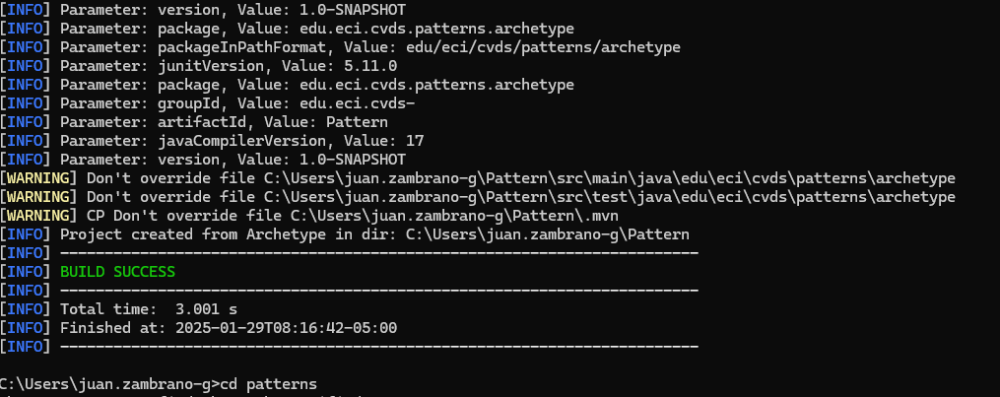
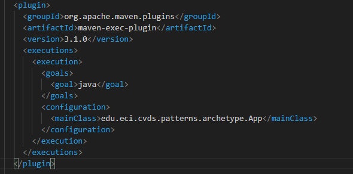
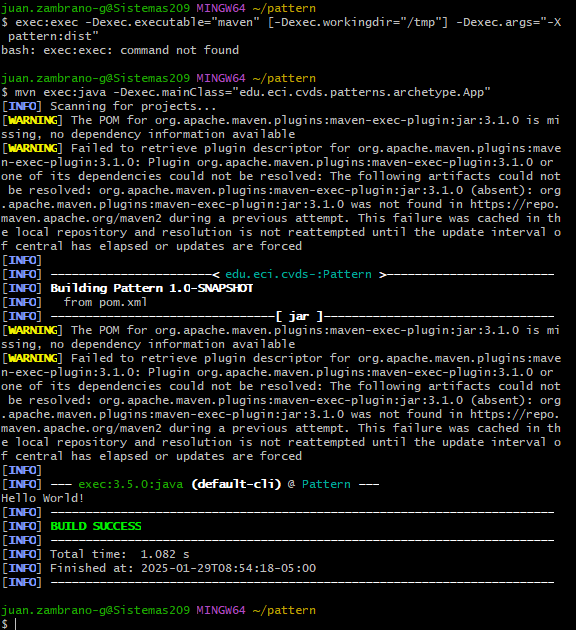
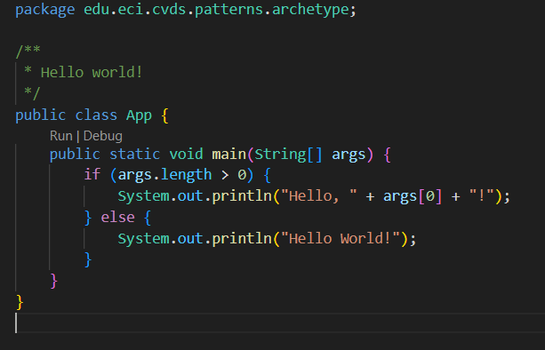

# LAB2_CVDS
## INTEGRANTES
-Juan David Zambrano 
-Allan Contreras 


## EJERCICIO DE LAS FUGURAS 

### 1. Investigamos como crear un proyecto en Maven con la ayuda de arquetipos, para esto nos guiamos del contenido del documento (Maven in five minutes).


    Haciendo uso de la estructura que se presenta en la primera imagen, agregamos los parametros solicitados y creamos el proyecto.




    Usando :  
    ```sh
    $ tree
    ```
    Verificamos la estructura del proyecto.


    Comparamos con la estructura solicitada y verificamos que esta correcta.

### 2. AJUSTAR ALGUNAS CONFIGURACIONES DEL PROYECTO
    Agreagamos la version Java 8 del compilador.
    


   - ### cuál es el objetivo del parámetro "package" y qué otros parámetros se podrían enviar al comando mvn.


        El parámetro "package" en el comando mvn package se usa en Apache Maven para compilar el código fuente de un proyecto, ejecutar pruebas y ensamblar los archivos resultantes en un paquete distribuible, como un JAR o WAR, dependiendo del empaquetado definido en el archivo pom.xml.


        

        ## Parámetros útiles para `mvn`
        | Comando               | Descripción |
        |-----------------------|-------------|
        | `mvn clean`          | Borra el directorio `target/` y archivos generados. |
        | `mvn validate`       | Valida la configuración del proyecto y las dependencias. |
        | `mvn compile`        | Compila el código fuente. |
        | `mvn test`           | Ejecuta las pruebas unitarias. |
        | `mvn package`        | Compila y empaqueta el proyecto en un artefacto (`JAR`, `WAR`, etc.). |
        | `mvn install`        | Instala el artefacto en el repositorio local . |
        | `mvn deploy`         | Sube el artefacto a un repositorio remoto. |

- ### Busque cómo ejecutar desde línea de comandos, un proyecto maven y verifique la salida cuando se ejecuta con la clase App.java como parámetro en "mainClass".

    Primero nos aseguramos que tengamos un metodo Main:

    

    luego modificamos el pom.xml añadiendole un plugin de ejecucion.

    

    Ahora ejecutamos el proyecto usando:
    ```sh
    exec:exec -Dexec.executable="maven" [-Dexec.workingdir="/tmp"] -Dexec.args="-X pattern:dist"
    ```

    


    Modificamos para generar un saludo peersonalizado:

    

    y configuramos pom.xml

    

    Volvemos a ejecutar y obtenemos

    
    

    Ahora ejecutamos con un nombre como parametro

    ```sh
    mvn clean compile exec:java -Dexec.args="Juan"
    ```

    

    

    
    Ahora ejecutamos nombre y apellido como parametros y miramos que sucede

    ```sh
    mvn clean compile exec:java -Dexec.args="Juan Zambrano"
    ```
    

    

    Observamos que al ingresar nombre y apellido como parametros al ejecutar solo obtenemos el nombre.

    Para solucionar esto debemos modificar el codigo y asi  asegurarnos de que todos los argumentos se impriman correctamente, para que Maven pase argumentos compuestos es necesario encerrar las cadenas entre comillas simples dentro de comillas dobles y en el código, usamos String.join(" ", args) para manejar múltiples palabras.

    

    Ejecutamos de nuevo y obtenemos:

    ```sh
    mvn clean compile exec:java -Dexec.args='"Juan Zambrano"'
    ```

    
    

# HACER EL ESQUELETO DE LA APLICACIÓN    

    Creamos los paqutes Shapes y concrete


    Creamos los siguientes archivos:
- Shape.java
- RegularShapeType.java 
- Triangle.java
- Quadrilateral.java 
- Pentagon.java 
- Hexagon.java
- ShapeMain.java 
- ShapeFactory.java

    